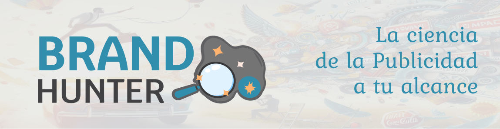

<h1 align="center"></h1>

# BrandHunter: Logo detection app

Welcome to the BranHunter project repository! This project is part of the AI School F5 Program, focusing on logo detection in images and videos using YOLOv8.

## Table of Contents
- [About the Project](#about-the-project)
- [Dataset](#dataset)
- [Getting Started](#getting-started)
- [Usage](#usage)
- [Team](#Team)

## About the Project

BrandHunter, a leading AI company in advertising, initiated this project to develop a logo detection model for analyzing brand visibility in videos. The project utilizes YOLOv8 for efficient and accurate logo detection.

## Dataset

We have used the flickr logos 27 dataset with more than 1000 images selected and tagged manually through the RoboFlow platform. Subsequently, we train the YOLOv8 model using this dataset for 100 epochs.

## Getting Started

To get started with the project, follow these steps:

1. Clone the repository:
   
```
git clone https://github.com/AI-School-F5-P2/CVLogos.git
cd CVLogos
```

2. Intall dependencies:

```
pip install -r requirements.txt
```

4. Explore the project and check out the Dev branch for the latest developments.

## Usage

The main application is implemented in the app.py file. To run the application with Streamlit, navigate to the project root directory and use the following command:

```
streamlit run app.py
```
   
### Logo Detection on Image, Video, URL or Webcam:

To run logo detection in any of the available options, select the desired parameter by displaying the options in the sidebar within the Streamlit application.

## Team:
- **Karla Lamus** git: https://github.com/KarlaLamus
- **Gabriela Calzadilla** git: https://github.com/Gabvero
